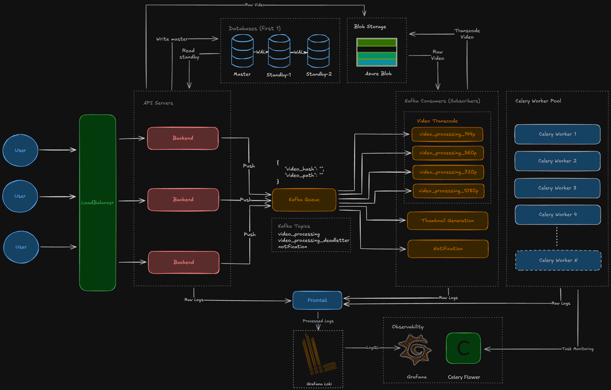

# VidPipeline

Raw, practical, and intentionally engineered — a distributed video streaming platform built for understanding HLS adaptive bitrate streaming, async video processing, and true fanout architecture patterns.

## System Architecture



## Overview

VidPipeline demonstrates a production-grade distributed video transcoding pipeline:

- **Chunked uploads** for large video files with resume capability
- **Parallel transcoding** to multiple HLS profiles (144p, 360p, 480p, 720p, 1080p)
- **True fanout architecture** using Kafka consumer groups
- **Database-tracked completion** with coordinated master playlist generation
- **Kafka + Celery + Redis** powered distributed processing
- **Azure Blob Storage** integration for scalable media delivery

## Key Features

- **Video Preprocessing** - ClamAV virus scanning and H.264 compression before transcoding
- **Parallel Profile Processing** - All resolutions transcode simultaneously  
- **Fanout Pattern** - Kafka consumer groups enable true parallel consumption  
- **Coordinated Completion** - Master playlist generated only when all profiles finish  
- **Independent Scaling** - Scale workers per profile (more 1080p workers than 144p)  
- **HLS-Only Output** - Optimized for modern adaptive streaming  
- **Production Ready** - Grafana, Prometheus, Loki monitoring included  

**Message Flow**

1. User uploads video chunks → finalize upload
2. FastAPI sends message to Kafka topic `video_preprocessing`
3. **Preprocessing worker** receives message:
   - Downloads video from Azure
   - Scans for viruses with ClamAV (blocks infected files)
   - Compresses video (H.264, veryfast preset for speed)
   - Extracts metadata (resolution, duration, codec)
   - Uploads compressed version
   - Sends message to `video_processing` topic
4. **6 consumer groups** (144p, 360p, 480p, 720p, 1080p, thumbnail) each receive the message (fanout)
5. Each consumer sends profile-specific Celery task to dedicated queue
6. FFmpeg workers transcode assigned profiles in parallel
7. Each completed profile marks database column as `TRUE`
8. Last profile to finish checks if all done → generates `master.m3u8`
9. Video status updated to `completed`

All processing is async, distributed, and decoupled.

## Output Structure

```
{{video_hash}}/
    source.mp4
    hls/
        master.m3u8              ← Generated after ALL profiles complete
        144p/
            playlist.m3u8
            segment_000.ts
            segment_001.ts
            ...
        360p/
            playlist.m3u8
            segment_000.ts
            ...
        480p/
        720p/
        1080p/
    thumbnail.jpg
```

## Tech Stack

- **Backend:** Python 3.12, FastAPI, SQLAlchemy Async
- **Video Processing:** FFmpeg with profile-specific transcoding
- **Message Queue:** Apache Kafka (fanout pattern with consumer groups)
- **Task Queue:** Celery with Redis backend
- **Storage:** Azure Blob Storage (configurable)
- **Database:** SQLite (dev), PostgreSQL compatible
- **Monitoring:** Grafana + Prometheus + Loki + Promtail
- **Frontend:** Vanilla JS demo pages

## Database Schema

The `videos` table tracks completion status for each profile:

```sql
CREATE TABLE videos (
    id INTEGER PRIMARY KEY,
    video_hash VARCHAR UNIQUE,
    title VARCHAR,
    status VARCHAR,  -- 'uploading', 'preprocessing', 'processing', 'completed', 'failed'
    
    -- Video metadata (extracted during preprocessing)
    width INTEGER,
    height INTEGER,
    duration INTEGER,
    codec VARCHAR,
    actual_mime_type VARCHAR,
    
    -- Profile completion tracking
    profile_144p_done BOOLEAN DEFAULT FALSE,
    profile_360p_done BOOLEAN DEFAULT FALSE,
    profile_480p_done BOOLEAN DEFAULT FALSE,
    profile_720p_done BOOLEAN DEFAULT FALSE,
    profile_1080p_done BOOLEAN DEFAULT FALSE,
    thumbnail_done BOOLEAN DEFAULT FALSE,
    
    -- URLs
    hls_master_url VARCHAR,
    thumbnail_url VARCHAR,
    
    created_at TIMESTAMP,
    updated_at TIMESTAMP
);
```

## Project Structure

```
VidPipeline/
├─ client/
│  ├─ index.html
│  └─ streaming.html
├─ server/app/
│  ├─ main.py
│  ├─ celery_app.py
│  ├─ api/video.py
│  ├─ utils/
│  │  ├─ azure_blob.py
│  │  ├─ celery_task.py
│  │  ├─ ffmpeg_util.py
│  │  ├─ virus_scan.py
│  │  └─ kafka.py
│  ├─ tasks/video_tasks.py
│  ├─ models/
│  ├─ schemas/
│  ├─ crud/
│  ├─ core/database.py
│  └─ media/
└─ README.md
```

---

# Setup Using Docker (Recommended)

This is the easiest, production-like setup with all 6 consumer groups and workers.

## 1. Clone the Repository

```bash
git clone https://github.com/Kaushik-Shahare/VidPipeline.git
cd VidPipeline
```

## 3. Create Environment Files

You need **two** `.env` files:

### **A) Root `.env` file (VidPipeline/.env)**

Used by docker-compose for global services.

```env
DATABASE_URL=sqlite+aiosqlite:///./server.db
KAFKA_BOOTSTRAP_SERVERS=kafka:29092
KAFKA_VIDEO_TOPIC=video_processing
REDIS_URL=redis://redis:6379/0

AZURE_STORAGE_CONNECTION_STRING=your_connection_string_here
AZURE_STORAGE_CONTAINER=videos
AZURE_STORAGE_URL=https://your_account.blob.core.windows.net/
```

### **B) Backend `.env` file (server/app/.env)**

```env
DATABASE_URL=sqlite+aiosqlite:///./server.db
KAFKA_BOOTSTRAP_SERVERS=kafka:29092
KAFKA_VIDEO_TOPIC=video_processing
REDIS_URL=redis://redis:6379/0

AZURE_STORAGE_CONNECTION_STRING=your_connection_string_here
AZURE_STORAGE_CONTAINER=videos
AZURE_STORAGE_URL=https://your_account.blob.core.windows.net/
```

## 4. Start Services

From project root:

```bash
docker compose up -d
```

This starts:

- **Kafka broker + Zookeeper**
- **Redis** (Celery backend)
- **FastAPI backend**
- **6 Kafka consumers** (one per profile: 144p, 360p, 480p, 720p, 1080p, thumbnail)
- **6 Celery workers** (one per profile queue)
- **Kafka UI** ([http://localhost:8081](http://localhost:8081))
- **Flower** (Celery monitoring at [http://localhost:5555](http://localhost:5555))
- **Grafana** ([http://localhost:3001](http://localhost:3001))
- **Prometheus** ([http://localhost:9090](http://localhost:9090))

## 5. Verify Consumers Running

Check all consumer groups are active:

```bash
docker exec -it kafka kafka-consumer-groups \
  --bootstrap-server kafka:29092 \
  --list
```

You should see:
- `video_processing_144p`
- `video_processing_360p`
- `video_processing_480p`
- `video_processing_720p`
- `video_processing_1080p`
- `video_processing_thumbnail`

## 6. Access the App

- **Backend API:** [http://localhost:8000/docs](http://localhost:8000/docs)
- **Kafka UI:** [http://localhost:8081](http://localhost:8081)
- **Flower (Celery):** [http://localhost:5555](http://localhost:5555)
- **Grafana:** [http://localhost:3001](http://localhost:3001) (admin/admin)
- **Frontend demo:** [http://localhost:3000](http://localhost:3000)

---

# Manual Setup (Local Development)

For running consumers and workers locally without Docker.

## Prerequisites

```bash
# Install FFmpeg
brew install ffmpeg  # macOS
# or
sudo apt install ffmpeg  # Ubuntu/Debian
```

## 1. Clone & Setup Backend

## 1. Clone & Setup Backend

```bash
git clone https://github.com/Kaushik-Shahare/VidPipeline.git
cd VidPipeline/server/app
python -m venv venv
source venv/bin/activate  # On Windows: venv\Scripts\activate
pip install -r requirements.txt
```

## 2. Run Database Migration

```bash
python migrations/add_profile_tracking_columns.py
```

## 3. Start Infrastructure (Kafka + Redis)

```bash
cd ../..
docker compose up -d kafka zookeeper redis
```

## 4. Start Kafka Consumers (6 terminals)

```bash
# Terminal 1: 144p consumer
export CONSUMER_PROFILE=144p
export KAFKA_CONSUMER_GROUP=video_processing_144p
python server/app/kafka_consumer_service.py

# Terminal 2: 360p consumer
export CONSUMER_PROFILE=360p
export KAFKA_CONSUMER_GROUP=video_processing_360p
python server/app/kafka_consumer_service.py

# Terminal 3: 480p consumer
export CONSUMER_PROFILE=480p
export KAFKA_CONSUMER_GROUP=video_processing_480p
python server/app/kafka_consumer_service.py

# Terminal 4: 720p consumer
export CONSUMER_PROFILE=720p
export KAFKA_CONSUMER_GROUP=video_processing_720p
python server/app/kafka_consumer_service.py

# Terminal 5: 1080p consumer
export CONSUMER_PROFILE=1080p
export KAFKA_CONSUMER_GROUP=video_processing_1080p
python server/app/kafka_consumer_service.py

# Terminal 6: Thumbnail consumer
export CONSUMER_PROFILE=thumbnail
export KAFKA_CONSUMER_GROUP=video_processing_thumbnail
python server/app/kafka_consumer_service.py
```

## 5. Start Celery Workers (6 more terminals)

```bash
# Worker 1: 144p queue
cd server/app
celery -A celery_app worker --loglevel=info -Q video_processing_144p

# Worker 2: 360p queue
celery -A celery_app worker --loglevel=info -Q video_processing_360p

# Worker 3: 480p queue
celery -A celery_app worker --loglevel=info -Q video_processing_480p

# Worker 4: 720p queue
celery -A celery_app worker --loglevel=info -Q video_processing_720p

# Worker 5: 1080p queue
celery -A celery_app worker --loglevel=info -Q video_processing_1080p

# Worker 6: Thumbnail queue
celery -A celery_app worker --loglevel=info -Q video_processing_thumbnail
```

## 6. Start FastAPI Backend

```bash
cd server/app
uvicorn main:app --reload --port 8000
```

---

# Usage

## Upload and Process a Video

1. **Upload video chunks** via `client/index.html` or API:
   ```bash
   curl -X POST http://localhost:8000/videos/upload \
     -F "file=@video.mp4" \
     -F "chunk=0" \
     -F "total_chunks=1"
   ```

2. **Finalize upload** to trigger processing:
   ```bash
   curl -X POST http://localhost:8000/videos/finalize/{video_hash}
   ```

3. **Processing begins automatically:**
   - Message sent to Kafka topic `video_processing`
   - All 6 consumer groups receive the message (fanout)
   - Each profile transcodes in parallel
   - Database columns marked as profiles complete
   - Last profile generates `master.m3u8`

4. **Monitor progress:**
   - Kafka UI: http://localhost:8081 (consumer lag)
   - Flower: http://localhost:5555 (Celery tasks)
   - Database: Query `profile_*_done` columns

5. **View results** in `client/streaming.html` or access HLS master:
   ```
   http://localhost:8000/media/{video_hash}/hls/master.m3u8
   ```

## Output Files

After processing completes:

```
/media/{video_hash}/
├── source.mp4
├── hls/
│   ├── master.m3u8           ← Use this for playback
│   ├── 144p/
│   │   ├── playlist.m3u8
│   │   ├── segment_000.ts
│   │   └── ...
│   ├── 360p/
│   ├── 480p/
│   ├── 720p/
│   └── 1080p/
└── thumbnail.jpg
```

---

# Scaling & Performance

## Horizontal Scaling

Scale specific profile workers based on processing time:

```bash
# 1080p takes longest - add more workers
docker compose up -d --scale worker_1080p=4

# Or scale consumers for higher throughput
docker compose up -d --scale consumer_1080p=2
```

## Profile-Specific Tuning

Allocate resources based on complexity:

```bash
# High concurrency for fast profiles
celery -A celery_app worker -Q video_processing_144p,video_processing_360p -c 4

# Low concurrency for resource-intensive profiles
celery -A celery_app worker -Q video_processing_1080p -c 1
```

---

# Monitoring & Observability

## Kafka Consumer Lag

Check if consumers are keeping up with the message rate:

```bash
docker exec -it kafka kafka-consumer-groups \
  --bootstrap-server kafka:29092 \
  --describe \
  --group video_processing_1080p
```

## Database Status Query

Check which profiles are completed:

```sql
SELECT 
    video_hash,
    status,
    profile_144p_done,
    profile_360p_done,
    profile_480p_done,
    profile_720p_done,
    profile_1080p_done,
    thumbnail_done
FROM videos
WHERE status = 'processing';
```

## Celery Queue Lengths

Via Flower UI or Redis CLI:

```bash
redis-cli -h localhost -p 6379
> LLEN video_processing_1080p
> LLEN video_processing_360p
```

## Grafana Dashboards

Access pre-configured dashboards at http://localhost:3001:

- **System Metrics**: CPU, memory, disk usage
- **Kafka Metrics**: Consumer lag, message throughput
- **Celery Metrics**: Task success/failure rates, queue lengths
- **Application Logs**: Centralized via Loki + Promtail

---

# Troubleshooting

### Profile not completing

**Symptoms:** One or more profiles stuck in processing

**Debug steps:**
1. Check consumer logs: `docker logs consumer_360p`
2. Check worker logs: `docker logs worker_360p`
3. Verify Celery queue has tasks: `redis-cli LLEN video_processing_360p`
4. Check FFmpeg errors in worker logs
5. Verify source file exists and is downloadable

### Master playlist not generated

**Symptoms:** All profiles done but no `master.m3u8`

**Debug steps:**
1. Query database - all 6 `profile_*_done` columns should be `TRUE`:
   ```sql
   SELECT * FROM videos WHERE video_hash = 'your_hash';
   ```
2. Check logs of the last-completing worker for master generation errors
3. Manually trigger by re-running any profile task (it will check completion)

### Slow transcoding performance

**Solutions:**
1. Check CPU usage: `docker stats`
2. Add more workers for slow profiles (720p, 1080p)
3. Enable hardware acceleration (if available):
   - macOS: `h264_videotoolbox`
   - Linux+NVIDIA: `h264_nvenc`
4. Reduce output bitrates in `ffmpeg_util.py`

### Kafka consumer lag growing

**Symptoms:** Messages piling up in Kafka

**Solutions:**
1. Scale up consumers: `docker compose up -d --scale consumer_360p=3`
2. Scale up workers: `docker compose up -d --scale worker_360p=3`
3. Check if workers are stuck or erroring
4. Increase Celery concurrency: `-c 4` instead of default

---

# FFmpeg Errors

### FFmpeg Errors

**Common issues:**
- File paths incorrect → Check upload directory exists
- Permissions issue → Ensure worker can write to `media/uploads/`
- macOS hardware acceleration not supported → Falls back to `libx264` automatically
- Codec errors → Ensure FFmpeg supports H.264 and AAC

### Kafka Not Receiving Messages

**Debug steps:**
1. Verify topic exists:
   ```bash
   docker exec -it kafka kafka-topics --list --bootstrap-server kafka:29092
   ```
2. Check producer logs in FastAPI backend
3. Verify `KAFKA_BOOTSTRAP_SERVERS` matches in all services

2. Check worker is connected: Look for "Connected to redis://..." in worker logs
3. Ensure queue names match between consumer and worker
4. Test Redis connection: `redis-cli -h localhost ping`

### HLS Playback Issues

**Common causes:**
- Must be served over HTTP, not `file://`
- Check CORS headers in FastAPI
- Verify MIME types: `.m3u8` → `application/vnd.apple.mpegurl`
- Browser may not support HLS natively (use hls.js library)

---

# Future Enhancements

- **Adaptive profile selection** - Skip high-res profiles if source is low-res
- **Audio-only tracks** - Extract audio for bandwidth savings
- **Subtitle/caption support** - WebVTT track generation
- **Progress tracking** - Real-time percentage updates via WebSocket
- **Retry mechanism** - Automatic retry for failed profiles
- **Webhooks** - Notify external services on completion
- **Cost optimization** - Skip unnecessary profiles based on analytics
- **Multi-audio tracks** - Support multiple language audio streams
- **DRM support** - Add encryption for premium content
- **Thumbnail timeline** - Generate sprite sheets for seek preview

---

# Acknowledgments

Built to demonstrate real-world distributed system patterns without enterprise overhead. Perfect for learning, portfolios, and interviews.

**Key Technologies:**
- Apache Kafka (fanout messaging)
- Celery (distributed task queue)  
- FFmpeg (video transcoding)
- FastAPI (async Python web framework)
- Redis (message broker & cache)

**Architecture Patterns:**
- Fanout messaging with consumer groups
- Pub/Sub model
- Database-coordinated completion
- Parallel task processing
- Async/await throughout
